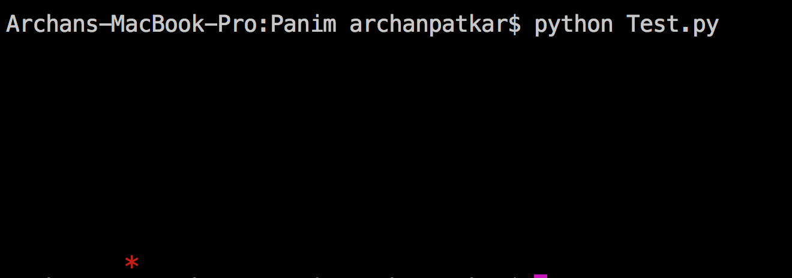

# Panim
### A Console Animation Library 🔆
### Made with ❤️ in  🇮🇳

## Example Usage
```python
from Panim import *

gotoxy(10,10);
foreground(RED);
putchar('*');
putchar('\n');
foreground(WHITE);
```
### Output


## License
### MIT
#### Copyright (c) 2018 Archan Patkar, All rights reserved.
